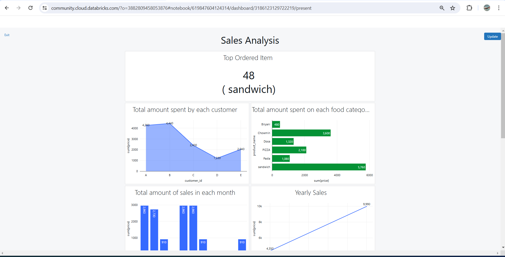
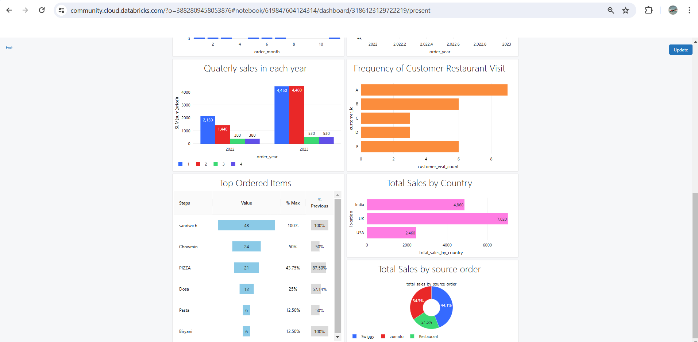

## Sales data Analysis using Spark in Databricks

This project is an analysis of some sales data over the period of 2 years.

Spark was used to process the data on databricks platform

Click this link to see the dashboard visulization.

https://databricks-prod-cloudfront.cloud.databricks.com/public/4027ec902e239c93eaaa8714f173bcfc/3882809458053876/619847604124314/8607450424403436/latest.html

### Below are the Visualization of the data analyzed

 

